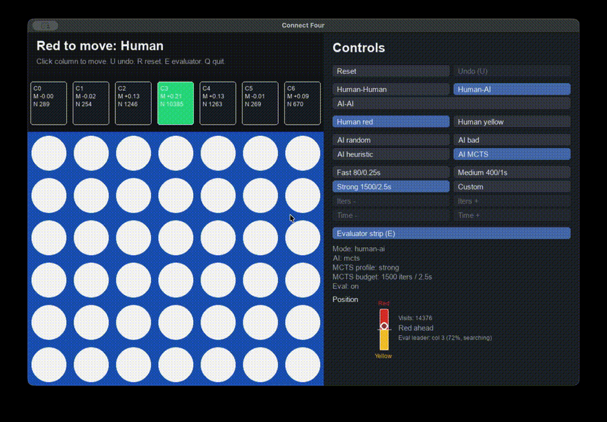
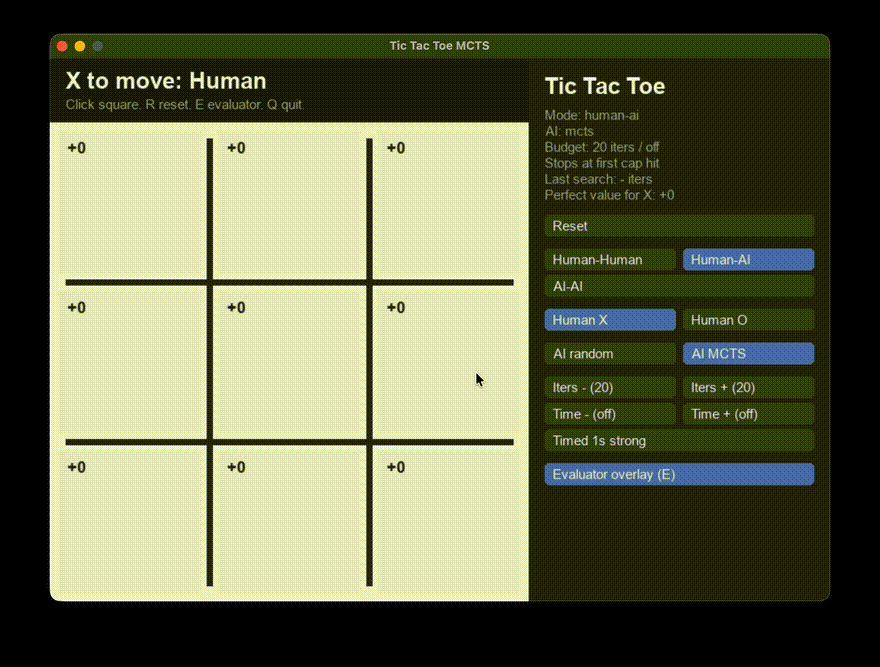

# ME 569 RL: Connect Four With MCTS

This project implements and evaluates Monte Carlo Tree Search for Connect Four.
The codebase is organized around reusable game-state objects so the same rules
drive interactive pygame play, Gymnasium-style environments, scripted
experiments, and small MCTS testbeds.

## Quick Start

Set up the environment once:

```bash
uv sync --dev
source .venv/bin/activate
```

If the virtual environment is not activated, prefix commands with `uv run`.

Launch the Connect Four GUI:

```bash
connect4-play
```

The GUI lets you switch modes, agents, MCTS strength, and the evaluator without
restarting. CLI arguments are optional and only set the initial state:

```bash
connect4-play --mode human-ai --ai mcts --human-player yellow
```

The Connect Four evaluator strip shows per-column MCTS estimates while the
side panel tracks the Red-vs-Yellow position estimate:



Launch the smaller Tic Tac Toe debugging GUI:

```bash
tictactoe-play
```

The Tic Tac Toe GUI is useful because it overlays exact minimax values for a
solved game before moving to the larger Connect Four search problem.



For command-line runs without activation:

```bash
uv run connect4-play
uv run tictactoe-play
uv run ultimate-tictactoe-play
```

Launch the Ultimate Tic Tac Toe GUI:

```bash
ultimate-tictactoe-play
```

The Ultimate Tic Tac Toe app reuses the shared MCTS engine with a 9x9 board,
forced local-board targeting, completed-board free moves, local board claims,
and a full-game evaluation bar.

## Connect Four App

Run:

```bash
connect4-play
```

Controls:

```text
Click a column: play a human move
U: undo
R: reset
E: toggle evaluator strip
M: toggle human-AI / AI-AI
[: lower custom MCTS iteration cap
]: raise custom MCTS iteration cap
-: lower custom MCTS time cap
=: raise custom MCTS time cap
Q/Esc: quit
```

Modes:

- `Human-Human`: both players are controlled by clicks.
- `Human-AI`: one player is human and the other is the selected AI.
- `AI-AI`: both players are controlled by the selected AI.

Agents:

- `random`: samples uniformly from legal columns.
- `bad`: deliberately weak heuristic that prefers low-scoring legal moves.
- `heuristic`: takes immediate wins, blocks immediate losses, then uses a
  one-ply hand-built board evaluator.
- `mcts`: UCT MCTS with random rollouts by default.
- `first-legal`: deterministic debugging baseline that chooses the leftmost
  legal column.

The heuristic board evaluator rewards center control, open two-in-a-row
windows, and open three-in-a-row windows, while penalizing comparable opponent
threats.

MCTS profiles in the GUI are mutually exclusive:

- `Fast 80/0.25s`
- `Medium 400/1s`
- `Strong 1500/2.5s`
- `Custom`

The `Iters +/-` and `Time +/-` controls only work when `Custom` is selected.

The evaluator strip shows per-column MCTS estimates:

```text
M = MCTS mean rollout value for that move
N = MCTS visits for that move
green = current MCTS preferred column
```

The side-panel gauge converts the evaluator's root value to a Red-vs-Yellow
display. Interpret it as the current MCTS evaluator's estimate under its search
budget and rollout policy, not as a solved-game statement. Under ideal play,
standard Connect Four is a first-player win, but this implementation is an
approximate search engine.

One important UI detail: the evaluator search keeps running in small slices
while the board position is unchanged. If a human pauses to think, the
evaluator can accumulate far more visits than the selected AI profile gets for
its actual move. The move-playing MCTS does not reuse the evaluator's tree; for
example, `Strong 1500/2.5s` is still compute-bound to that per-move budget even
if the evaluator has been thinking for much longer. This is why the visible
evaluator can help a human find moves that beat the capped AI.

## MCTS Variant

The main search algorithm is UCT MCTS:

```text
selection -> expansion -> rollout/simulation -> backpropagation
```

Selection uses a UCB1-style rule at each tree node:

```text
score = mean_value + c * sqrt(log(parent_visits) / child_visits)
```

The implementation stores values from the root player's perspective. At
root-player nodes, selection favors high values. At opponent nodes, selection
favors low root-player values because the opponent is assumed to choose moves
that hurt the root player.

## Tic Tac Toe MCTS Tutorial

Use Tic Tac Toe as the small debugging testbed before Connect Four.

Notebook tutorial:

```text
notebooks/mcts_tutorial_tictactoe.ipynb
```

Verbose CLI trace:

```bash
tictactoe-mcts --iterations 300 --seed 0 --verbose
```

The `--verbose` flag is required because the script otherwise only returns the
final state. Verbose mode prints selected actions, root-child visit counts,
mean values, and board states after each move.

Interactive Tic Tac Toe GUI:

```bash
tictactoe-play
```

The Tic Tac Toe GUI includes exact minimax values:

```text
+1 = current player can force a win
 0 = perfect play should draw
-1 = current player loses against perfect response
```

Scope of this testbed:

- It validates the shared MCTS interface and data flow on a tiny solved game.
- It helps debug selection, expansion, rollout, and backpropagation.
- It does not include Connect Four column actions, larger branching factors,
  heuristic rollouts, value-network cutoffs, or exploration-constant sweeps.
  Those are evaluated in the Connect Four experiments.

## Project Layout

```text
src/connect4/core.py                    # Connect Four state, legal moves, win/tie logic
src/connect4/agents.py                  # random, heuristic, and MCTS agents
src/connect4/mcts.py                    # game-independent UCT MCTS
src/connect4/env.py                     # Gymnasium-style environments
src/connect4/pygame_app.py              # Connect Four pygame app and evaluator UI
src/connect4/value_model.py             # lightweight offline value network
src/connect4/scripts/evaluate_agents.py # tournament and report experiment scripts
src/connect4/scripts/generate_value_dataset.py
src/connect4/scripts/train_value_model.py
src/connect4/tictactoe/                 # Tic Tac Toe MCTS testbed scripts
notebooks/                              # tutorial notebooks and exploratory analysis
tests/                                  # unit tests
```

## Gymnasium-Style Environments

Alternating-turn self-play environment:

```python
from connect4.env import ConnectFourEnv

env = ConnectFourEnv()
obs, info = env.reset(seed=0)
obs, reward, terminated, truncated, info = env.step(3)
```

Single learner vs fixed opponent environment:

```python
from connect4.agents import RandomAgent
from connect4.core import Player
from connect4.env import ConnectFourVsAgentEnv

env = ConnectFourVsAgentEnv(opponent=RandomAgent(seed=0), learner_player=Player.RED)
obs, info = env.reset(seed=0)
obs, reward, terminated, truncated, info = env.step(3)
```

Both environments include `info["action_mask"]`, which is needed by RL
algorithms that must avoid full columns.

## Experiment Commands

Use `20` games or `20` games per side for quick checks. Use `100` or `200` for
final report runs if runtime is acceptable.

### Baseline Agent Matchups

Quick run:

```bash
connect4-evaluate matchups --agents random,bad,heuristic,mcts:100,mcts:500 --games 20 --seed 0 --progress-every 5
```

Report run:

```bash
connect4-evaluate matchups --agents random,bad,heuristic,mcts:100,mcts:500 --games 100 --seed 0 --progress-every 10
```

This is useful for showing that the baseline ordering is sensible:

```text
bad < random < heuristic < stronger MCTS
```

### Simulation Budget Sweep

This isolates the effect of MCTS simulations per move.

```bash
connect4-evaluate c-sweep --iterations 10,50,100,500,1000 --exploration-weights sqrt2 --games-per-side 100 --seed 0 --csv outputs/connect4_budget_sweep.csv --plot outputs/connect4_budget_sweep.png --progress-every 10
```

### Exploration Constant Sweep

This tests the UCT exploration constant `c` at two fixed simulation budgets.

```bash
connect4-evaluate c-sweep --iterations 100,500 --exploration-weights 0.25,0.5,1.0,sqrt2,2.0,4.0 --games-per-side 100 --seed 0 --progress-every 10
```

The experiment plays both colors against the fixed heuristic baseline. The goal
is to understand sensitivity to `c`, not to claim a globally optimal constant.
The best `c` can depend on the simulation budget.

The CSV reports a normal-approximation 95% confidence interval half-width:

```text
p_hat +/- 1.96 * sqrt(p_hat * (1 - p_hat) / n)
```

### Rollout Policy Sweep

Compare random rollouts with heuristic-guided rollouts:

```bash
connect4-evaluate rollout-policy-sweep --policies random,heuristic --iterations 100,500 --games-per-side 100 --seed 0 --progress-every 10
```

For final report comparison, use the same opponent, color-swapping, seed, and
iteration settings as the exploration sweep.

### Offline Value-Function Rollouts

Generate value-function training data from a documented mixture of agents:

```bash
connect4-generate-value-data --games 200 --seed 0
```

Default data-generation mix:

```text
heuristic=0.15,mcts:100=0.30,mcts:500=0.35,mcts:1500=0.20
```

The dataset stores pre-move boards and labels each position with the final game
outcome from the side-to-move perspective.

Train the lightweight NumPy value network:

```bash
connect4-train-value-model --epochs 20 --seed 0
```

Then include the value-function cutoff in the rollout-policy comparison:

```bash
connect4-evaluate rollout-policy-sweep --policies random,heuristic,value --value-model outputs/value_models/connect4_value_model.npz --value-depth 8 --iterations 100,500 --games-per-side 100 --seed 0 --progress-every 10
```

The `value` condition performs a short random rollout up to `--value-depth`.
If the state is still non-terminal, the trained value network estimates the
outcome. Training cost is up front; experiment CSVs report move-time cost
separately with `mcts_seconds_per_move`.

## Suggested Final Report Run List

Minimum useful run set:

```bash
connect4-evaluate matchups --agents random,bad,heuristic,mcts:100,mcts:500 --games 100 --seed 0 --progress-every 10
connect4-evaluate c-sweep --iterations 10,50,100,500,1000 --exploration-weights sqrt2 --games-per-side 100 --seed 0 --csv outputs/connect4_budget_sweep.csv --plot outputs/connect4_budget_sweep.png --progress-every 10
connect4-evaluate c-sweep --iterations 100,500 --exploration-weights 0.25,0.5,1.0,sqrt2,2.0,4.0 --games-per-side 100 --seed 0 --progress-every 10
connect4-evaluate rollout-policy-sweep --policies random,heuristic --iterations 100,500 --games-per-side 100 --seed 0 --progress-every 10
```

Optional value-network run set:

```bash
connect4-generate-value-data --games 200 --seed 0
connect4-train-value-model --epochs 20 --seed 0
connect4-evaluate rollout-policy-sweep --policies random,heuristic,value --value-model outputs/value_models/connect4_value_model.npz --value-depth 8 --iterations 100,500 --games-per-side 100 --seed 0 --progress-every 10
```

For the report, prefer plots over large tables:

- MCTS win rate vs simulations per move.
- MCTS win rate vs exploration constant.
- Random vs heuristic-guided vs value-cutoff rollout policy.
- One compact baseline matchup table.

## Tests

Run:

```bash
pytest
```

The tests are written with standard `unittest` classes, so this also works:

```bash
python -m unittest discover -s tests
```
